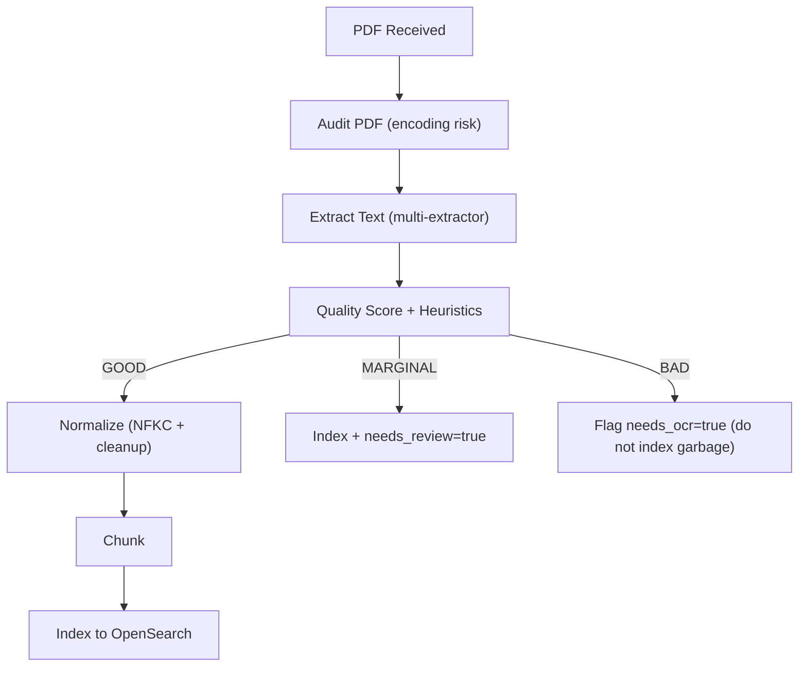

# Arabic + English PDF Handling Strategy (No OCR Implemented Yet)

This document defines how the system should handle Arabic legal PDFs *today* and how we decide when to flag a document for OCR later (Milestone 4).

Goal: handle **English and Arabic text-based PDFs** as well as possible, and **detect** when extraction is unreliable so we can fall back to OCR in a controlled way.

## 1) Why Arabic PDFs Break More Often

### 1.1 PDF text is not "normal text"

A PDF is primarily a *drawing format*. The page shows glyphs at coordinates.

To extract readable text, an extractor needs a correct mapping from the glyphs to Unicode characters. This mapping is usually provided via a `ToUnicode` CMap in the PDF.

### 1.2 Common failure modes

- **Missing/incorrect ToUnicode maps**
  - Extractors produce wrong characters or Arabic "presentation forms" (glyph shapes) rather than standard Arabic letters.
  - Result looks like `ﻥﻭﻨﺎﻘﻟﺍ` or includes many `ﺔ`, `ﻟ`, `ﻌ` shaped letters.

- **RTL/Bidi ordering problems**
  - Arabic is right-to-left (RTL), but numbers and punctuation often behave differently.
  - Extracted output can appear reversed, with broken word boundaries, or with punctuation placed incorrectly.

- **Font encoding tricks**
  - Some PDFs use custom encodings where glyph ID does not map to the expected letter.
  - This often defeats "text extraction" and requires OCR.

## 2) Key Insight: Search Needs Clean Unicode

OpenSearch Arabic analyzers (and any keyword search engine) can only help if the indexed text is **actual Arabic Unicode letters** (e.g., `قانون العمل`).

If the extracted output is glyph-shaped or encoded incorrectly, analyzers will not fully fix it. The correct fallback is OCR.

## 3) Current Policy (Milestone 3)

### 3.1 Pipeline overview

Notes:
- **No OCR is implemented in this milestone**.
- We only **flag** `needs_ocr` or `needs_review` so we can route these documents later.

### 3.2 Multi-extractor strategy

We try multiple extractors because no single library works best for all PDFs:

- `pdfplumber` (often good for structured docs)
- `PyMuPDF (pymupdf)` (sometimes better for Arabic encoding)
- `pdfminer.six` (sometimes better logical order)
- `pypdf` (fallback)

We select the "best" candidate using a quality scoring function that favors:
- more Arabic letters (`\u0600-\u06FF`) and readable text
- fewer Arabic presentation-form glyphs
- fewer replacement characters (`\ufffd`)

### 3.3 Normalization

After extraction we normalize:
- Unicode normalize to `NFKC`
- Remove bidi marks, tatweel, and diacritics (improves search recall)
- Normalize whitespace and paragraphs

This is safe for search and helps with many PDFs, but it does not fix fundamentally broken glyph mapping.

## 4) Audit Step (What We Want, and Why)

The audit step is a lightweight inspection that helps decide:
- Is text extraction likely to work?
- Or is this PDF high risk and should go to OCR?

### 4.1 What we audit (planned checks)

We want to determine:
- whether the PDF has usable ToUnicode mappings
- the fraction of Arabic "presentation form" glyphs
- whether extraction produces "garbage" patterns

The exact implementation can vary by library, but the output should be consistent.

### 4.2 Audit output (recommended fields)

Store on the job/document:
- `extractor_candidates`: list of extractors attempted (names)
- `selected_extractor`: which one we used
- `quality_score`: integer score
- `arabic_letter_count`
- `arabic_presentation_form_count`
- `replacement_char_count`
- `has_tounicode`: true/false/unknown

## 5) Quality Assessment Heuristics

We classify extraction as GOOD / MARGINAL / BAD.

### 5.1 Useful measurements

- `arabic_letters`: count of `\u0600-\u06FF`
- `presentation_forms`: count of:
  - Arabic Presentation Forms-A: `\uFB50-\uFDFF`
  - Arabic Presentation Forms-B: `\uFE70-\uFEFF`
- `replacement_chars`: count of `\ufffd`
- `length`: total text length

### 5.2 Suggested thresholds (starting point)

These are initial thresholds; tune using real PDFs.

- BAD:
  - `presentation_forms > 50` in the normalized output, OR
  - `length < 200` (likely scan or empty extraction), OR
  - `replacement_chars` is high (e.g., > 20)

- MARGINAL:
  - some presentation forms present but not dominant, AND
  - enough Arabic letters to be useful

- GOOD:
  - presentation forms low, Arabic letters high, length meaningful

## 6) What to Do Per Classification

### GOOD
- Normalize -> chunk -> index
- Search should work for Arabic queries like `قانون العمل` and `المادة`.

### MARGINAL
- Normalize -> chunk -> index
- Set `needs_review=true` (metadata flag)
- Expect imperfect search but still better than nothing.

Important caveat:
- Tools like `arabic_reshaper` are primarily for *display* and are not a guaranteed fix for extraction quality.
- If we try any post-processing beyond normalization, it should be opt-in and measured, because it can reorder legal text in risky ways.

### BAD
- Do **not** index garbage.
- Set `needs_ocr=true` and store error message like:
  - "Arabic PDF extraction produced many presentation-form glyphs. OCR required."

## 7) OpenSearch Mapping for Arabic + English

We index `text` with subfields:
- `text.en` uses English analyzer (better stemming for English)
- `text.ar` uses Arabic analyzer (better normalization/stemming for Arabic)

Search uses `multi_match` across all of them.

Important: this does not require language detection; it works because Arabic tokens match better in `text.ar` and English tokens match better in `text.en`.

## 8) Production Notes (Future)

### 8.1 Reindexing best practice

When mappings evolve, use versioned indices:
- `chunks_v1`, `chunks_v2`, `chunks_v3`
and an alias:
- `chunks_current` -> points to the active index

This allows zero-downtime migrations and safe rollbacks.

### 8.2 OCR plan (Milestone 4)

Milestone 4 will implement:
- PDF -> images (300 DPI recommended)
- OCR in Arabic + English (`ara+eng`)
- confidence scoring
- `needs_review=true` when OCR confidence is low

For now (Milestone 3), we only set flags and messages.

## 9) How to Validate (Practical Test Plan)

Collect 6 PDFs:
- 2 English text-based PDFs
- 2 Arabic text-based PDFs
- 2 Arabic scanned PDFs

Expected outcomes:
- English text-based PDFs: GOOD, indexed, searchable
- Arabic text-based PDFs: ideally GOOD or MARGINAL; searchable for common terms
- Arabic scanned PDFs: BAD/needs_ocr, not indexed (until OCR exists)

Search test queries:
- Arabic: `قانون`, `المادة`, `العمل`, `الجريدة الرسمية`
- English: `agreement`, `regulation`, `termination`, `liability`

