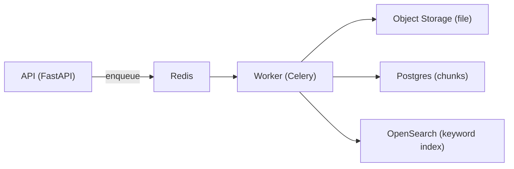

# Milestone 3 (Detailed): Text Extraction + Basic Chunking + Keyword Search

Milestone 3 turns uploaded legal documents into **searchable text chunks**.

If Milestone 2 is "we can upload a document and track a job", Milestone 3 is "we can extract text, split it into chunks, and search it with keywords".

This guide is written to be implementation-ready and beginner-friendly.

## 0) What Milestone 3 Delivers (Success Criteria)

After Milestone 3, you can:

- Upload a **PDF** or **DOCX** (from Milestone 2)
- Run an ingestion job that:
  - extracts text (no OCR yet)
  - produces chunks with metadata (doc_id, section_path placeholder, offsets)
  - indexes chunks to OpenSearch (keyword/BM25 only)
- Call a search endpoint and get results:
  - ranked snippets
  - document metadata
  - chunk IDs and section info (basic)

Milestone 3 explicitly does NOT include:

- OCR for scanned PDFs (Milestone 4)
- Legal citation extraction (Milestone 5)
- Section-aware chunking (Milestone 6)
- Embeddings / vector search (Milestone 7)

## Quick Run Notes (When You're Ready To Run)

When Docker is installed and the stack is up, the typical order is:

1. Run DB migrations (compose already has the `migrate` one-shot service).
2. Initialize OpenSearch index:
   - `POST /v1/admin/opensearch/init`
3. Upload a PDF/DOCX:
   - `POST /v1/documents/upload`
4. Poll the job status:
   - `GET /v1/jobs/{job_id}`
5. Verify chunks exist:
   - `GET /v1/documents/{document_id}/chunks`
6. Keyword search:
   - `POST /v1/search`

## 1) Prerequisites

Milestone 3 assumes Milestone 2 exists with at least:

- A `documents` table (document metadata + storage key/path)
- An `ingest_jobs` table (job status tracking)
- An upload endpoint that stores files and creates a job
- A worker that can pick jobs from Redis

If Milestone 2 is not implemented yet, Milestone 3 should be planned but not coded until the Document + Job basics exist.

## 2) Architecture (Where Milestone 3 Fits)

Milestone 3 mainly adds logic inside the Worker:

- Input: a `document_id` + access to the stored file
- Output:
  - extracted text saved (DB or storage)
  - chunks saved in Postgres
  - chunks indexed in OpenSearch

## 3) Data Model Additions (Postgres)

We add tables for extracted content. Names can vary; the important part is the fields.

### 3.1 `document_texts` (optional but recommended)

Purpose: keep a canonical extracted text snapshot per document version.

Recommended fields:

- `id` (uuid)
- `document_id` (uuid, FK)
- `version_id` (uuid, nullable if you don't have versions yet)
- `text` (long text) OR `text_object_key` (if stored in object storage)
- `extraction_method` (enum-ish string: `pdf_text`, `docx_text`)
- `page_map_json` (optional: mapping from text offsets -> page numbers)
- `created_at`

Why optional:

- Some systems only store chunks and don't store the full extracted text.
- Storing full text makes debugging and later improvements easier.

### 3.2 `chunks`

Purpose: each chunk is the unit we retrieve and cite later.

Recommended fields:

- `id` (uuid)
- `document_id` (uuid, FK)
- `version_id` (uuid, nullable)
- `ordinal` (int, ordering within document)
- `section_path` (json array of strings, placeholder in Milestone 3)
- `text` (chunk text)
- `char_start` (int, optional)
- `char_end` (int, optional)
- `token_count` (int, optional; can be approximate)
- `created_at`

Note:

- In Milestone 3, `section_path` can be a single placeholder like `["(unknown)"]`.
- In Milestone 6 we will fill it with real `Article/Section/Clause` structure.

## 4) OpenSearch Index (Keyword Search Only)

We create an OpenSearch index for chunks, for example:

- index name: `chunks_v1`

Each indexed document represents one chunk with fields like:

- `chunk_id` (uuid string)
- `document_id`
- `text`
- `jurisdiction`
- `year`
- `law_type`
- `source`
- `section_path` (array of strings)
- `ordinal` (int)

Mapping (conceptual):

- `text`: `text` type (BM25)
- filters: `keyword` or numeric types (so filters are fast and exact)

In Milestone 3, we do NOT store vectors in OpenSearch.

## 5) Extraction (PDF + DOCX)

### 5.1 PDF Text Extraction

Goal: extract readable text for "born-digital" PDFs (not scanned images).

Approach:

- Try library A, fallback to library B:
  - `pdfplumber` (great for layout-aware extraction)
  - `pypdf` (fast fallback)

Output:

- `text` (string)
- optionally `pages[]` (list of page texts) so we can track page boundaries

Important failure modes:

- Some PDFs return very little text because they are scans (Milestone 4 will OCR those).
- Some PDFs produce text with lots of line breaks; chunking should normalize whitespace.

### 5.2 DOCX Text Extraction

Approach:

- Use `python-docx`
- Extract paragraphs in order

Output:

- `text` (string)
- optionally paragraph boundaries

## 6) Chunking (Basic v1)

Chunking splits a long text into smaller parts to improve search and later RAG grounding.

Milestone 3 uses a **simple chunking strategy**:

- Split on paragraph boundaries when possible
- Merge paragraphs until a size limit is reached
- Keep a small overlap to preserve context across boundaries

Recommended parameters:

- `max_chars`: 1500 to 2500 characters per chunk
- `overlap_chars`: 150 to 250 characters
- Hard minimum chunk size: avoid tiny chunks like 1-2 lines unless needed

Normalization:

- Convert multiple whitespace/newlines to single spaces
- Preserve important separators (e.g., keep blank line as paragraph boundary before normalization)

Why we do it this way:

- It works for many legal documents without a complicated parser.
- It provides a stable base for section-aware chunking later.

## 7) Worker Job Steps (Milestone 3)

Worker pipeline for an ingest job:

1. Load document metadata from Postgres.
2. Fetch the file from storage (local path or object key).
3. Detect file type (`.pdf` vs `.docx`).
4. Extract text (PDF extractor or DOCX extractor).
5. Validate extraction:
   - If extracted text length is too small, mark job as `needs_ocr` or `failed` with reason.
6. Chunk the text (basic chunker).
7. Insert chunks in Postgres.
8. Index chunks in OpenSearch `chunks_v1`.
9. Mark job as `completed`.

Idempotency rule:

- If a job is retried, it should not duplicate chunks/index docs.
- Use stable chunk IDs or delete-and-replace strategy per document version.

## 8) API Endpoints (Milestone 3)

Milestone 3 should add read APIs to verify outputs.

Recommended endpoints:

- `GET /v1/documents/{document_id}/chunks?limit=50&offset=0`
  - returns chunk list
- `POST /v1/search`
  - request body: `{ "query": "...", "filters": {...}, "top_k": 10 }`
  - returns ranked chunk results + doc metadata

Filters supported (at least):

- `jurisdiction`
- `year` (exact or range)
- `law_type`

In Milestone 3, search is keyword-only:

- It still supports filters.
- It still returns snippets.

## 9) Examples (Concrete)

### 9.1 Example: Keyword Search (Citizen)

Query:

- "unfair dismissal notice period"

Filters:

- jurisdiction = "EU"
- year_min = 2018

Expected result:

- Top chunks contain "notice period" / "termination" sections
- Response includes document title/source, chunk text snippet, and score

### 9.2 Example: Lawyer Research Query (Keyword-only for now)

Query:

- "limitation of liability clause enforceability"

Filters:

- jurisdiction = "US"
- law_type = "case_decision"
- year_min = 2015

Expected result:

- Top chunks include language like "limitation of liability", "conspicuous", "unconscionable"
- Later milestones add vector search and citation linking to strengthen this

## 10) Testing Plan (Milestone 3)

### Unit tests

- PDF extractor:
  - should return non-empty text for a known text PDF
- DOCX extractor:
  - should return ordered paragraph text
- Chunker:
  - should never exceed max size by more than a small tolerance
  - should include overlap behavior
  - should preserve ordering and create stable ordinals

### Integration tests (docker compose)

- Upload -> job -> chunks inserted -> OpenSearch index -> search returns results

Golden test documents (keep in a test-only folder):

- `sample_text.pdf` (selectable text)
- `sample.docx`
- `sample_scanned.pdf` (should fail/mark needs OCR in Milestone 3)

## 11) Operational Notes (Production-minded)

- Log extraction metrics:
  - extracted text length
  - number of chunks
  - time spent extracting/chunking/indexing
- Store an error code/message on job failure:
  - `extraction_failed`
  - `unsupported_format`
  - `empty_text_needs_ocr`

## 12) Milestone 3 Checklist (Quick)

- Worker can extract text from PDF and DOCX
- Worker creates chunks with stable ordering
- Chunks stored in Postgres
- Chunks indexed in OpenSearch for BM25 keyword search
- API can list chunks for a document
- API can search with keyword + filters
