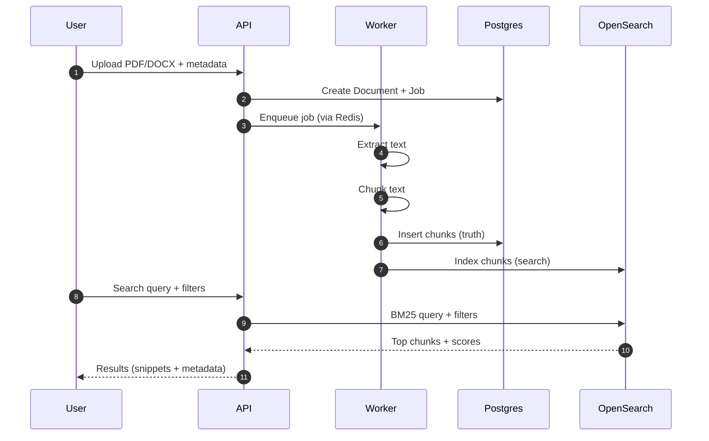

# OpenSearch + Chunking Guide (Beginner-Friendly, Detailed)

This guide explains:

- What OpenSearch is and why we use it in this project
- How keyword search (BM25) works at a practical level
- What an "index" and a "mapping" mean
- How we store **chunks** in OpenSearch
- How chunking works (and why it matters)
- End-to-end workflow: upload -> chunk -> index -> search

This is written for someone who has never used OpenSearch before.

## 1) What Is OpenSearch?

OpenSearch is a search engine (like Elasticsearch). It stores documents (JSON objects) and lets you search them efficiently.

In this project, OpenSearch is responsible for:

- Ranking text results by relevance (keyword search now, hybrid search later)
- Filtering results by metadata (jurisdiction/year/law_type)
- Returning the best matching chunks quickly

### Why not just use Postgres for search?

Postgres can do keyword search, but a dedicated search engine is typically better for:

- large datasets
- relevancy ranking and scoring
- search performance
- future hybrid search (keyword + vectors) and advanced ranking

So:

- **Postgres** = source of truth (documents, chunks, jobs, citations, graph)
- **OpenSearch** = search index optimized for retrieval

## 2) Core Terms You Must Know

### 2.1 Index

An **index** is like a table in a database, but designed for search.

Example:

- Index name: `chunks_v1`
- It contains many records, each record is one **chunk**.

### 2.2 Document (in OpenSearch)

In OpenSearch, a "document" means a JSON record stored in an index.

Example chunk document stored in OpenSearch:

```json
{
  "chunk_id": "3c0cfe2f-2b1f-4dc2-9d0d-41f39d4f5c0e",
  "document_id": "12d5b0a4-caf7-4e2f-8207-7bb0fb6b3c9c",
  "text": "Article 3. The employer shall provide written notice...",
  "jurisdiction": "EU",
  "year": 2019,
  "law_type": "regulation",
  "section_path": ["Article 3"],
  "ordinal": 17
}
```

### 2.3 Mapping

A **mapping** describes the schema of OpenSearch fields, especially how they should be indexed for search.

Important mapping types:

- `text`: analyzed text for keyword search (BM25)
- `keyword`: exact match field for filtering and aggregations
- `integer`: numeric field for range queries

In our `chunks_v1` mapping:

- `text` is `text` (searchable)
- `jurisdiction`, `law_type`, `source`, `document_id` are `keyword` (filterable)
- `year` is `integer` (range filter)
- `section_path` is `keyword` (so you can filter/aggregate by sections)

### 2.4 Analyzer (simple explanation)

For fields of type `text`, OpenSearch uses an analyzer:

- breaks text into tokens (words)
- normalizes tokens (lowercase, etc.)

This is what makes keyword search work.

## 3) What Is BM25 (Keyword Ranking)?

BM25 is a standard keyword relevance scoring algorithm.

Intuition:

- Documents that contain your query terms are relevant
- Documents where query terms appear more often can be more relevant
- Shorter documents can be preferred (to avoid long documents matching everything)

In this project, BM25 is used to rank chunks by keyword relevance.

### Example

Query:

- "limitation of liability clause"

Chunks that contain exactly these phrases (or the individual terms) will rank higher.

## 4) Why We Use Chunks (Instead of Whole Documents)

Legal documents are long. If we search whole documents:

- The result might be too broad ("this 300-page law matches")
- LLM/RAG later would get huge text (slow and expensive)

Chunks solve this:

- Search returns **small, focused** pieces
- Later the LLM can cite and quote specific sections
- Metadata stays attached to each chunk

## 5) Chunking: What It Is and How We Do It

Chunking means splitting a big text into smaller pieces.

Milestone 3 chunking is "basic" (not section-aware yet):

- Split by paragraphs where possible
- Merge until reaching a size limit
- Add small overlap between chunks

Later (Milestone 6) we do **section-aware chunking** (Article/Clause), which is better for law documents.

### 5.1 Chunk Size (Practical)

We often define chunk size by:

- characters (easy)
- tokens (better, but requires tokenization)

In Milestone 3 we usually start with character limits.

Typical values:

- `max_chars`: ~1500 to 2500
- `overlap_chars`: ~150 to 250

### 5.2 What Is Overlap and Why It Matters?

Overlap means the end of chunk N is repeated at the start of chunk N+1.

This helps because:

- important sentences can sit at boundaries
- context is not lost across chunks

Example:

- Chunk 1 ends with "... subject to the following conditions:"
- Chunk 2 starts with the condition list

With overlap, both chunks have a piece of the boundary context.

### 5.3 Chunk Metadata

Each chunk includes metadata so we can:

- order chunks (`ordinal`)
- later map chunks to document structure (`section_path`)
- filter search results (jurisdiction, year, law_type)

## 6) End-to-End Workflow (How Everything Connects)

This is the high-level story:

1. Upload a document (PDF/DOCX)
2. Store the raw file
3. Worker extracts text from the raw file
4. Worker chunkifies the extracted text
5. Save chunks to Postgres (source of truth)
6. Index chunks to OpenSearch (search optimized)
7. Search queries hit OpenSearch and return best chunks



## 7) What We Implemented So Far (Milestone 3 Part 1)

We defined:

- Postgres tables for:
  - `document_texts` (full extracted text snapshot)
  - `chunks` (chunk records)
- OpenSearch keyword-only index definition:
  - `chunks_v1` mapping + settings
- A minimal init endpoint:
  - `POST /v1/admin/opensearch/init`
  - creates `chunks_v1` if it doesn't exist

Why we have an init endpoint:

- OpenSearch does not create mappings automatically the way we want.
- We want a predictable schema for filtering and consistent search behavior.

## 8) Practical Examples (Conceptual)

### 8.1 Filtering examples

Filter: jurisdiction = "US"

- Returns only chunks where `jurisdiction` keyword field equals "US"

Filter: year >= 2018

- Returns only chunks where `year` integer field satisfies range

Filter: law_type = "case_decision"

- Returns only chunks from case decisions

### 8.2 Why metadata matters for legal search

Without metadata filters, a query like:

- "Article 3"

could match a huge number of unrelated documents.

With filters:

- jurisdiction = "EU"
- law_type = "regulation"
- year = 2019

you can narrow results to the exact regulation.

## 9) Common OpenSearch Pitfalls (Beginner Notes)

- If you index `year` as `text`, range queries won't work.
  - It must be `integer` to do `year >= 2015`.
- If you index `jurisdiction` as `text`, filtering may behave unexpectedly.
  - It should be `keyword` for exact filters.
- Changing mappings later is not trivial.
  - Better to design mappings early and version indexes (e.g., `chunks_v1`, `chunks_v2`).

## 10) What's Next (Milestone 3 Part 2+)

Next steps after Part 1:

- Worker actually extracts text from PDF/DOCX
- Worker writes `document_texts` and `chunks`
- Worker indexes chunks into OpenSearch `chunks_v1`
- API adds `POST /v1/search` endpoint

Later milestones:

- OCR (Milestone 4) for scanned PDFs
- citation extraction + linking (Milestone 5)
- section-aware chunking (Milestone 6)
- embeddings + vector search + hybrid scoring (Milestone 7)

